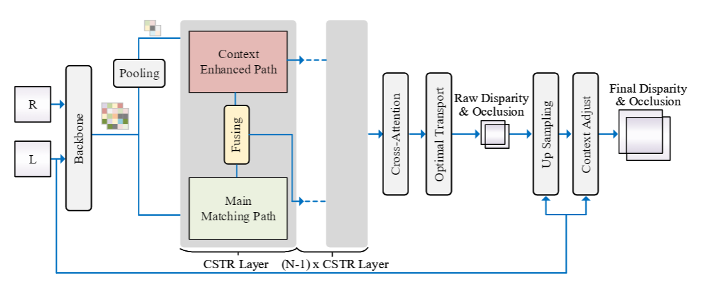

# Context enhanced stereo transformer(CSTR)


This is the official repo for our work Context enhanced stereo transformer(CSTR)



## Dependencies
We recommend the following steps to set up your environment
- Create your python virtual environment by 
    ``` sh
    conda create --name CSTR python=3.8 # create a virtual environment called "CSTR" with python version 3.8
    ```
    
- **Install Pytorch 1.9** and cuda 11.6: 
  - Other versions of Pytorch may have problem during evaluation.
  
- **Other third-party packages**: You can use pip to install the dependencies by 
    ```sh
    pip install -r requirements.txt
    ``` 

## Pre-trained Models
You can download the pretrained model from the following links:

| Models                                                                        |  Link    | 
|:------------------------------------------------------------------------------|:---------:|
| **CSTR** (Scene Flow pretrained,plugging context enhanced path to sttr-light) |  [Download link](https://drive.google.com/file/d/1sfBytVVHFPj7GjHQkSu3VwBnpruCWfiB/view?usp=sharing)    |
- Note: the pretrained model is only trained on FlyingThings3D sub-dataset. 

## Folder Structure
#### Code Structure
```
Context enhanced stereo-transformer
    |_ dataset (dataloder)
    |_ module (network modules, including loss)
    |_ utilities (training, evaluation, inference, logger etc.)
```
 


## Usage


- Download pretrained model using links in [Pre-trained Models](https://drive.google.com/file/d/1sfBytVVHFPj7GjHQkSu3VwBnpruCWfiB/view?usp=sharing).
- Run pretraining by
    ```
    sh scripts/pretrain.sh
    ```

- Run fine-tune on dataset by
    ```
    sh scripts/finetune.sh
    ```
  
- Run evaluation on the  middlebury  by
    ```
    sh scripts/middlebury_eval.sh
    ```
    - Note: the pretrained model is assumed to be in the `stereo-transformer` folder. 


    
## License
This project is under the Apache 2.0 license. 
 
## Contributing
We try out best to make our work easy to transfer. If you see any issues, feel free to fork the repo and start a pull request. 


